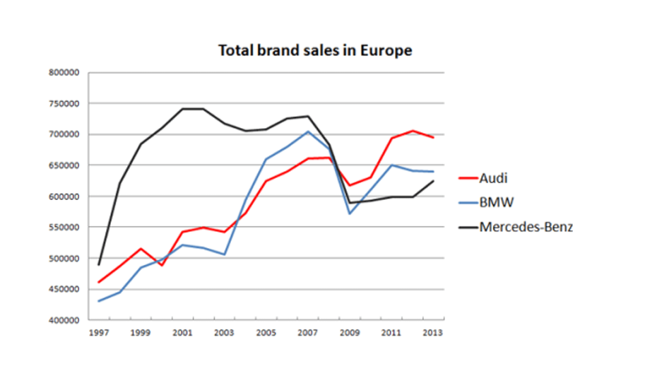

# CHECKLIST EVALUATION — FIGURE 1 : Total Brand Sales in Europe

## 1. DATA

| Criterion | OK? | Explanation |
|-----------|-----|-------------|
| The type of graphic is adapted | ✔️ | Time series → line chart is appropriate. |
| Approximations/interpolation make sense | ✔️ | Linear interpolation between years is acceptable. |
| Curves have enough points | ✔️ | Yearly data from 1997–2013 → sufficient points. |
| Interpolation method clear | ✔️ | Implicit linear interpolation. |
| Confidence intervals included | ❌ | No uncertainty shown. |
| Histogram steps adequate | N/A | Not a histogram. |
| Histograms visualize probabilities | N/A | Not a histogram. |

## 2. GRAPHICAL OBJECTS

| Criterion | OK? | Explanation |
|-----------|-----|-------------|
| Readable on screen/print | ✔️ | Lines and text visible. |
| Standard color range | ✔️ | Colors fine. No green. |
| Axes well identified | ❌ | No axis labels ("Sales", "Years"). |
| Scales + units explicit | ❌ | No units ( "Cars sold ??"). |
| Curves cross without ambiguity | ✔️ | Crossings are generally clear. |
| Grid helps the reader | ✔️ | Light grid present. |

## 3. ANNOTATIONS

| Criterion | OK? | Explanation |
|-----------|-----|-------------|
| Axes labelled by quantities | ❌ | Missing quantity labels ("Sales (units)"). |
| Labels clear & self-contained | ❌ | Not self-contained → ambiguous. |
| Units indicated | ❌ | Missing "cars" or "thousand units". |
| Axes oriented correctly | ✔️ | Standard orientation used. |
| Origin at (0,0) or justified | ❌ | Y-axis starts at 400k → not justified. |
| No hole on axes | ✔️ | Continuous axes. |
| Order of bars (if bar chart) | N/A | Not a bar chart. |
| Each curve has a legend | ✔️ | Legend on right. |
| Each bar has a legend | N/A | Not a bar chart. |

## 4. INFORMATION

| Criterion | OK? | Explanation |
|-----------|-----|-------------|
| Curves on same scale | ✔️ | All share same Y-axis. |
| Few curves (<6) | ✔️ | Only 3 curves. |
| Compare curves on same graph | ✔️ | Yes. |
| Cannot remove curve without losing info | ✔️ | All three are meaningful. |
| Provides relevant information | ✔️ | Shows evolution of brand sales. |
| If averages: error bars | ❌ | Missing (data likely uncertain). |
| No removable object without impact | ✔️ | All elements serve a purpose. |

## 5. CONTEXT

| Criterion | OK? | Explanation |
|-----------|-----|-------------|
| All symbols defined in text | ❌ | No units or variable definitions. |
| Produces more info than other representations | ✔️ | Line chart shows trends effectively. |
| Graphic has a title | ✔️ | "Total brand sales in Europe". |
| Title self-contained | ❌ | Missing information about units and specific data type. |
| Graphic referenced in text | ❌ | No text context provided. |
| Text comments the figure | ❌ | No accompanying text. |
