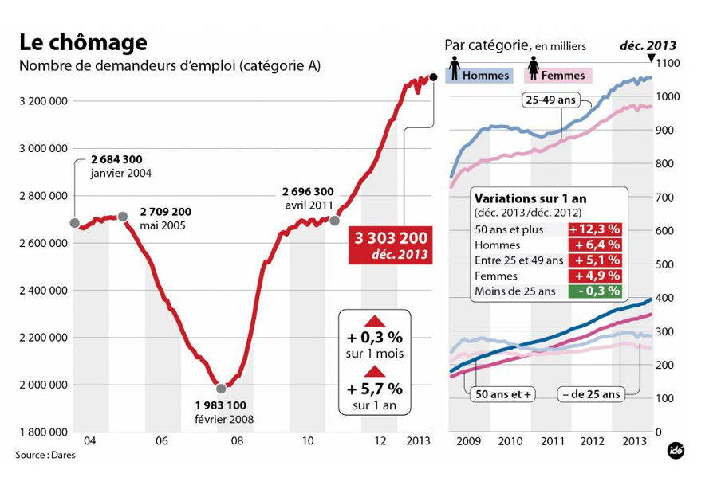

# CHECKLIST EVALUATION — FIGURE 2 : Le Chômage

This figure is very complex, combining multiple graphs, annotations, colors, categories, and numeric highlights. It contains too much information for a single graphic.

## 1. DATA

| Criterion | OK? | Explanation |
|-----------|-----|-------------|
| Type adapted to data | ✔️ | Time series → line charts appropriate. |
| Interpolation makes sense | ✔️ | Linear connection between monthly data is acceptable. |
| Curves have enough points | ❌ | Many monthly samples from 2003–2013. |
| Interpolation method clear | ❌ | Not stated. Viewer must assume. |
| Confidence intervals shown | ❌ | No uncertainty. Economic data normally includes CI/margins. |
| Histogram-related items | N/A | Not a histogram. |

## 2. GRAPHICAL OBJECTS

| Criterion | OK? | Explanation |
|-----------|-----|-------------|
| Readable on screen/print | ❌ | Very dense, small text, multiple mini-graphs → difficult to read. |
| Standard color range | ✔️ | Blue/pink consistent for gender; red for main curve. |
| Axes identified & labelled | ❌ | Units not clearly stated ("Nombre de demandeurs d'emploi" is written, but Y-axis does not show "persons"). |
| Scales + units explicit | ❌ | Good scales and unit definition. |
| Curves cross unambiguously | ✔️ | No ambiguous crossings. However, overlapping curves in side panel reduce clarity. |
| Grid helps reader | ✔️ | Light grid is helpful but overused with so many sections. |

## 3. ANNOTATIONS

| Criterion | OK? | Explanation |
|-----------|-----|-------------|
| Axes labelled by quantities | ❌ | X-axis has only years; Y-axis has numbers but not the dimension. |
| Labels clear & self-contained | ❌ | Without title, axes alone are unclear ("3,200,000 of what?"). |
| Units indicated | ❌ | Should explicitly state the unit on the axes. |
| Axes orientation standard | ✔️ | Standard orientation used. |
| Origin at (0,0) justified | ✔️ | Good. |
| No holes in axes | ✔️ | Continuous axes. |
| Bars ordered logically | N/A | Not a bar graph. |
| Each curve has a legend | ✔️ | Gender-coded legend is present. |
| Each bar has legend | N/A | No bars. |

## 4. INFORMATION

| Criterion | OK? | Explanation |
|-----------|-----|-------------|
| Curves on same scale | ❌ | Main graph uses absolute numbers; side graphs use different Y-scale ranges. |
| <6 curves on a graph | ❌ | Whole figure contains many, making it crowded. |
| Curves compared on same graph | ✔️ | Gender curves compared appropriately. |
| Cannot remove curve without losing info | ✔️ | Each category has meaning. |
| Graphic gives relevant info | ✔️ | Shows unemployment evolution and categories. |
| Averages show error bars | ❌ | No average displayed. |
| No removable objects without impact | ❌ | Many decorative elements and repeated labels add clutter. |

## 5. CONTEXT

| Criterion | OK? | Explanation |
|-----------|-----|-------------|
| Symbols defined & referenced | ❌ | No text context. |
| Graphic produces more info than alternatives | ❌ | Too many details, splitting into several graphs would be clearer. |
| Graphic has a title | ✔️ | Clear ("Le chômage"). |
| Title self-contained | ✔️ | Mentions category A, unemployment. |
| Graphic referenced in text | ❌ | No text context provided. |
| Text comments figure | ❌ | No accompanying text. |
