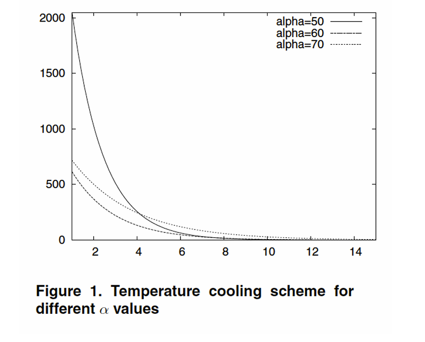

# ✅ CHECKLIST EVALUATION — FIGURE 3 : Temperature Cooling Scheme

## 1. DATA

| Criterion | OK? | Explanation |
|-----------|-----|-------------|
| Graphic type adapted | ✔️ | Line chart is appropriate for continuous decay curves. |
| Approximations/interpolation make sense | ✔️ | Smooth exponential-like curve → interpolation is natural. |
| Sufficient number of points | ✔️ | Curves look smooth and well sampled. |
| Interpolation method clear | ❌ | Not stated whether exponential, polynomial, etc. |
| Confidence intervals visualized | ❌ | No uncertainty (should show if data is experimental). |
| Histogram steps adequate | N/A | Not a histogram. |
| Histograms show probabilities | N/A | Not a histogram. |

## 2. GRAPHICAL OBJECTS

| Criterion | OK? | Explanation |
|-----------|-----|-------------|
| Readable on screen/print | ✔️ | Clean, simple, readable. |
| Standard colors (avoid green, similar colors) | ✔️ | Uses monochrome line styles. |
| Axes well identified & labelled | ❌ | No axis labels at all. |
| Scales + units explicit | ❌ | No unit for temperature, α, or time. |
| Curves cross without ambiguity | ✔️ | No intersections; curves clearly separated. |
| Grids help the reader | ❌ | No grid → difficult to estimate values. |

## 3. ANNOTATIONS

| Criterion | OK? | Explanation |
|-----------|-----|-------------|
| Axes labelled by quantities | ❌ | Missing "Time (t)" and "Temperature T(t)". |
| Labels clear & self-contained | ❌ | Curve labels rely only on "alpha" without context. |
| Units indicated | ❌ | No temperature units (°C, K, arbitrary). |
| Axes properly oriented | ✔️ | Standard orientation. |
| Origin justified | ✔️ | Starting near (0,0) is fine for decay curves. |
| No holes in axes | ✔️ | Continuous axis. |
| Bars ordered logically | ❌ N/A | Not a bar graph. |
| Each curve has legend | ✔️ | Legend exists (top-right). |
| Each bar has a legend | ❌ N/A | No bars. |

## 4. INFORMATION

| Criterion | OK? | Explanation |
|-----------|-----|-------------|
| Curves on same scale | ✔️ | Same axes for all α values. |
| Few curves (<6) | ✔️ | Only 3 curves. |
| Compare curves on the same graphic | ✔️ | Clear comparison. |
| Curve necessary | ✔️ | Removing one curve loses information. |
| Graphic provides relevant information | ✔️ | Shows effect of α on cooling rate. |
| Averages need error bars | ❌ | No error bars if experimental. |
| No removable objects | ✔️ | Clean and minimal, maybe too minimal. |

## 5. CONTEXT

| Criterion | OK? | Explanation |
|-----------|-----|-------------|
| All symbols defined in text | ❌ | No explanation of α (cooling constant). |
| Graphic produces more information than alternatives | ✔️ | Good comparative plot. |
| Graphic has a title | ✔️ | Title is present. |
| Title self-contained | ❌ | Missing context: α values, time units, function definition. |
| Graphic referenced in text | ❌ | No text context provided. |
| Text comments figure | ❌ | No accompanying text. |

