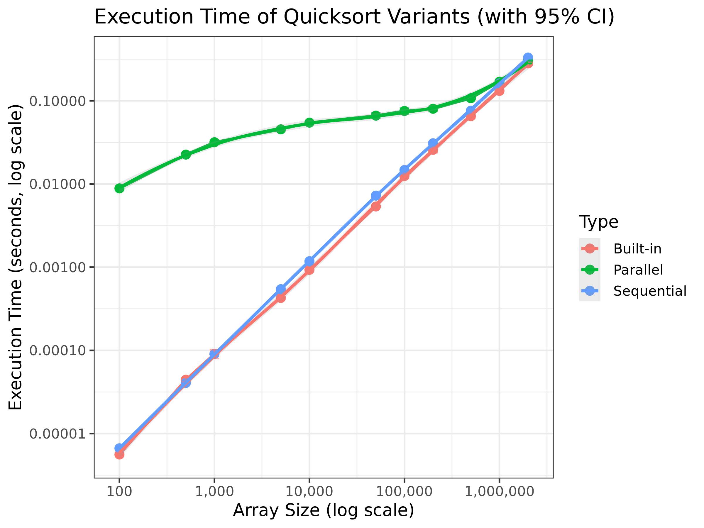

# Assignment 1: Experimental Evaluation of Parallel Quicksort

## Objective

This assignment focuses on reviewing and improving the performance evaluation of a multi-threaded quicksort implementation by applying good experimental methodology to obtain reliable, reproducible, and interpretable performance results for three sorting approaches:

- **Sequential Quicksort** (custom C implementation)
- **Parallel Quicksort** (Pthreads-based implementation)
- **libc qsort** (reference baseline)

---

## 1. Context

The project’s original benchmarking setup worked, but it had several important limitations:

### Too few repetitions

Only **5 executions** per configuration which not enough to estimate variance, detect anomalies, or compute confidence intervals reliably.

### Sparse selection of input sizes

Array sizes increased by powers of 10, hiding important transitions (where parallelism starts paying off).

### Limited data analysis

A clear analysis with plots and key statistical indicators (CI, smoothing, trends) was missing.

**My work addresses all these points.**

---

## 2. Improvements Implemented

### 2.1 Increased Sampling Density

I extended the number of repetitions to obtain more stable estimates:

```bash
for rep in `seq 1 30`; do
    ./src/parallelQuicksort $i >> $OUTPUT_FILE
done
```

### 2.2 Enhanced Set of Array Sizes

I refined the size grid to observe trends more precisely:

```
100, 500, 1000, 5000, 10000,
50000, 100000, 200000, 500000, 1000000, 2000000
```

This gives much better visibility on:
- when parallelism overhead dominates
- where parallel quicksort becomes competitive
- how each variant scales as n log n grows

### 2.3 Randomized Execution Order

To minimize systematic bias from execution order effects:

```bash
shuf_sizes=$(echo $sizes | tr ' ' '\n' | shuf)
```

This results in:
- more independent samples
- reduced systematic bias
- better statistical validity

### 2.4 Data Cleaning & Robust Parsing

The original text logs were converted into structured CSV using two scripts:
- `csv_quicksort_extractor.pl` : produces long-format CSV (Size, Type, Time)
- `csv_quicksort_extractor2.pl` : produces wide-format CSV (Size, Seq, Par, Libc)

I additionally cleaned the Type column to remove inconsistent spacing (" Parallel" vs "Parallel"), which was crucial for correct grouping and regression.

### 2.5 Statistical Analysis with R

The R analysis script (`analysis.R`) performs:

#### Summary statistics
For each (size, algorithm):
- mean execution time (central tendency)
- standard deviation (dispersion across runs)
- standard error (uncertainty on the estimated mean)

#### Confidence intervals (95%)
In the plots, confidence intervals are displayed as shaded bands around the mean values, allowing direct comparison of measurement reliability across algorithms and input sizes.

#### Scaling trend estimation (linear regression on log–log axes)
The script overlays a linear regression trend line on log–log axes that is useful for comparing asymptotic scaling behavior and provides an interpretable slope.

---

## 3. Repository Structure

```
.
├── src/
│   ├── parallelQuicksort.c       # Sequential + parallel quicksort implementation
│   ├── parallelQuicksort         # Compiled binary
│   └── Makefile                  # Build configuration
│
├── scripts/
│   ├── run_benchmarking.sh           # Automated experiment runner (improved)
│   ├── csv_quicksort_extractor.pl    # Long-format CSV parser
│   └── csv_quicksort_extractor2.pl   # Wide-format CSV parser
│
├── data/
│   └── <hostname>_<date>/        # Machine-specific measurement directory
│       ├── measurements_<time>.txt
│       ├── measurements_<time>.csv
│       ├── measurements_<time>_wide.csv
│       └── performance_plot.png
│
├── analysis.R                    # Main analysis and plotting script
└── README.md
```

---

## 4. How to Run the Experiment

### Step 1: Compile the sorting program

```bash
make -C src/
```

This will compile `parallelQuicksort.c` into the executable `src/parallelQuicksort`.

### Step 2: Execute the benchmark suite

```bash
bash scripts/run_benchmarking.sh
```

This produces raw logs in:
```
data/<hostname>_<date>/measurements_<time>.txt
```

### Step 3: Convert raw data to CSV

Extract the data into CSV format:

```bash
# Long format
perl scripts/csv_quicksort_extractor.pl < data/<hostname>_<date>/measurements_<time>.txt > data/<hostname>_<date>/measurements_<time>.csv

# Or wide format
perl scripts/csv_quicksort_extractor2.pl < data/<hostname>_<date>/measurements_<time>.txt > data/<hostname>_<date>/measurements_<time>_wide.csv
```

### Step 4: Run the analysis

Before running the R script, update the file path in `analysis.R` to point to your CSV file:

```r
df <- read.csv("./data/<hostname>_<date>/measurements_<time>.csv")
```

Then execute:

```bash
Rscript analysis.R
```

This generates plots including:
- `performance_plot.png` — visualization with confidence intervals and LOESS smoothing
- Summary statistics printed to console

---

## 5. Interpretation of Results



The improved methodology (30 repetitions, enhanced size grid, statistical analysis) provides a clear view of the performance behavior of the 3 quicksort variants.

### 5.1 Built-in qsort is consistently strong

The built-in qsort (blue) is the fastest variant across all tested sizes. Its curve is smooth, stable, and exhibits low variance thanks to optimized libc implementations.

### 5.2 Parallel quicksort has overhead at small sizes

The parallel version shows overhead at small sizes but potentially becomes competitive at larger sizes
This confirms that the cost of thread creation, synchronization, and recursion management dominates at these scales.

### 5.3 Confidence intervals reveal measurement stability

The 30 repetitions allow for meaningful confidence intervals:

- **Sequential** and **built-in** algorithms show very tight CIs, indicating stable performance.
- **Parallel quicksort** shows higher variance, reflecting sensitivity to thread scheduling and OS noise.
---

## Author

**Eya Ridene**  
M2 MOSIG — SMPE 2025–2026  
Université Grenoble Alpes

---

<!-- ## Notes

- The parallel quicksort uses a thread level of 10 (defined in `parallelQuicksort.c`)
- All timing measurements use `gettimeofday()` for microsecond precision
- The analysis requires R packages: `ggplot2`, `dplyr`, `scales`, and `tidyr`
- Install R packages if needed: `install.packages(c("ggplot2", "dplyr", "scales", "tidyr"))` -->
