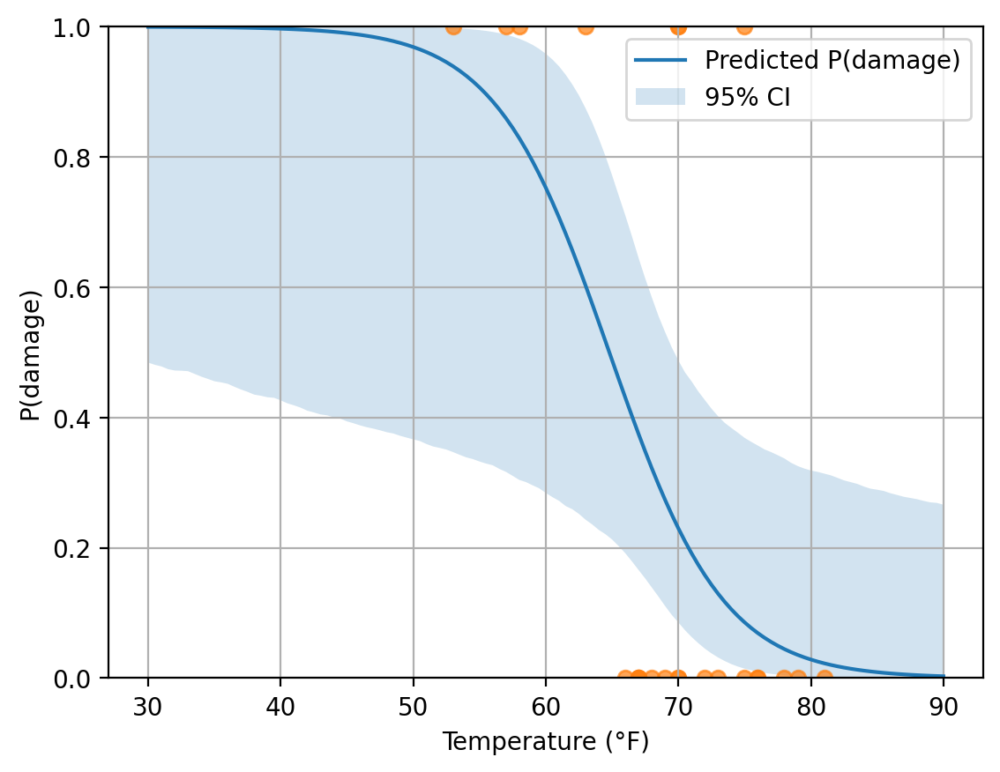

# The Challenger : MOOC Module 2 — Exercise 5
## Critical Examination of the Challenger O-ring Analysis

This report reviews the analysis provided in the challenger exercise and explains what is reasonable in the approach and what led to the serious under-estimation of the risk of O-ring failure.

---

## What is done correctly

- The document starts well: the historical context is clear, and the goal of the analysis is explicitly stated. 
- Using a probabilistic model (logistic/binomial regression) makes sense for this type of binary/binomial data.
- The first exploratory plot (malfunction frequency vs temperature) is reasonable (even though the dataset is small) and noting that pressure barely varies helps focus on temperature.

So the approach and the choice of the method are fine. The problem is how the data were handled.

---

## Problems in the analysis

### 1. The major issue: removing all flights with zero malfunctions

The main problem in this analysis is that it filters the data and removes all flights with `Malfunction = 0`:

```python
data = data[data.Malfunction > 0]
```
Flights with 0 malfunctions are informative: they show conditions under which the probability of malfunction is low. When removing them, we are only looking at flights where something already went wrong. This “conditioning on having a malfunction” makes the relationship with temperature look flat and that is a biased conditioning error. This is why the analysis concluded with : temperature has no effect. 

---

## 2. The logistic model is not set up correctly

Each flight involves 6 O-rings and the analysis computes `Success = Count − Malfunction`, but the fitted GLM uses only Frequency without properly using the binomial counts/weights. This doesn’t create the main bias (the filtering does), but it weakens the statistical meaning of the fit.

---

## 3. Wrong interpretation + unsafe extrapolation

After filtering, the analysis predicts the risk at 31°F. But 31°F is far outside the temperatures seen in the data, so the result is a strong extrapolation. Presenting the prediction as a reliable estimate without highlighting uncertainty gives a false sense of safety.

---

## Proposed corrected analysis

**1) Fix the selection bias**  
I keep all flights, including those with Malfunction = 0. These flights are required to estimate the true risk.

**2) Inspect the full data visually**  
I plot damage vs temperature using the full dataset. This reveals that damage occurs more often at lower temperatures, while higher temperatures mostly show no damage.

**3) Fit a corrected model**  
I fit a logistic regression on the full data with:  
`Damage = 1 if Malfunction > 0 else 0` and predictor `Temperature`. The fitted temperature coefficient is **negative and significant**, meaning: **colder temperature → higher risk**.

**4) Estimate risk at 31°F with CI**  
I compute the predicted probability at 31°F. Because 31°F is outside the observed temperature range, this is **extrapolation**, so I also report an uncertainty interval. Even with uncertainty, the corrected analysis does not support a low-risk conclusion for such cold conditions.

I also plot the predicted probability curve with a 95% confidence band:



## Conclusion

The analysis underestimates the risk mainly because it eliminates the flights with no damage, the most informative part of the dataset, which leads to the wrong conclusion that temperature has no effect. However, using the full dataset shows that the probability of O-ring failure increases at low temperatures. At 31°F, the predicted risk is very high (0.99960) to justify canceling the launch.